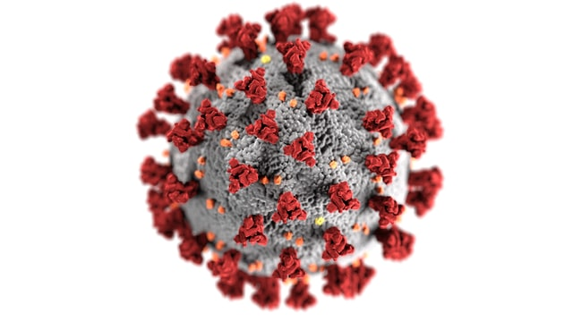

# My Portfolio
Data Science Portfolio

## [Project 4: Machine Learning - Water Potability](https://github.com/hibartaufik/water-potability)

Photo by <a href="https://unsplash.com/@manuschwendener?utm_source=unsplash&utm_medium=referral&utm_content=creditCopyText">Manu Schwendener</a> on <a href="https://unsplash.com/s/photos/water-drink?utm_source=unsplash&utm_medium=referral&utm_content=creditCopyText">Unsplash</a>

### Overview
Membuat model machine learning menggunakan dataset 'Water Quality', menggunakan metode klasifikasi dengan algoritma Random Forest agar dapat menentukan karakteristik jenis air mana yang dapat diminum dan yang tidak dapat diminum. penyusun dataset 'Water Quality' Aditya Kadiwal berpendapat bahwa akses ke air minum yang aman (bisa dan aman untuk diminum) merupakan hal yang penting untuk kesehatan, perwujudan dasar hak asasi dalam perlindungan jaminan kesehatan untuk setiap manusia.

Project ini menggunakan dataset yang berisi karakteristik air yang berbeda dengan setiap faktor yang mempengaruhi apakah air itu dapat diminum ataukah tidak, salah satunya nilai keasaman (pH) dan masih banyak lagi. Dataset dan Project yang saya lakukan merupakan bagian kecil dari perwujudan dan realitas bahwa masih banyak orang-orang di dunia yang sulit sekali mendapatkan akses air bersih yang aman dan bisa diminum.

---
## [Project 3: Machine Learning - Heart Attack Possibility](https://github.com/hibartaufik/heart-attack-possibility)

Photo by <a href="https://unsplash.com/@timmarshall?utm_source=unsplash&utm_medium=referral&utm_content=creditCopyText">Tim Marshall</a> on <a href="https://unsplash.com/s/photos/heart?utm_source=unsplash&utm_medium=referral&utm_content=creditCopyText">Unsplash</a>

### Overview
Serangan jantung merupakan penyakit yang masuk ke daftar penyebab kematian paling banyak beserta penyebab-penyebab kematian yang lainnya. *American Heart Association News* pada 2018 dalam artikelnya mengatakan bahwa serangan jantung kian sering terjadi pada orang yang lebih muda, khususnya perempuan. Meskipun respondennya berasal dari Amerika sana, namun tetap artikel tersebut tetap membuat saya sebagai seorang remaja waspada, dan tentu merupakan sebuah peringatan bahwa serangan jantung kini sudah bukan penyakit 'orang tua' lagi.

Saya menemukan banyak sekali dataset yang berisi data-data kesehatan, salah satunya serangan jantung. Serangan jantung merupakan topik yang memiliki banyak dataset pada situs kaggle, menunjukkan bahwa penyakit tersebut bukan penyakit yang 'jarang' dan terjadi di berbagai belahan dunia. Sebagai orang yang belum (dan tentu tak ingin mengalami) serangan jantung, ketersediaan dataset serangan jantung pada situs seperti kaggle menunjukkan bahwa kita dapat lebih waspada terhadap potensi serangan jantung melalui angka. Project ini memiliki beberapa referensi salah satunya dari *American Heart Association News* agar (menurut saya) bertujuan untuk lebih dapat memahami konteks dan istilah-istilah medis terkait peredaran darah dan kondisi jantung.

---
## [Project 2: Machine Learning - New Cases Prediction](https://github.com/hibartaufik/New-Cases-Prediction)

Photo by <a href="https://unsplash.com/@cdc?utm_source=unsplash&utm_medium=referral&utm_content=creditCopyText">CDC</a> on <a href="https://unsplash.com/s/photos/virus?utm_source=unsplash&utm_medium=referral&utm_content=creditCopyText">Unsplash</a>

### Overview
Sudah dua tahun pandemi COVID-19 melanda dunia, termasuk Indonesia yang terkena dampak yang besar (termasuk untuk saya sebagai seorang pelajar), merubah berbagai kebiasaan manusia dari berbagai aspek kehidupan untuk bisa menyesuaikan agar tetap 'aman' dan sehat tentunya. Project ini menggunakan dataset yang berisi penyebaran COVID-19 di Indonesia dari awal hingga bulan Maret 2021. 

Project ini merupakan sebuah apresiasi terhadap Hendratno, penyusun dataset yang meluangkan waktunya untuk dapat mengumpulkan data dari berbagai sumber, karena selain bermanfaat bagi saya sebagai seorang pelajar yang ingin membangun portfolio data, juga bermanfaat untuk para expert-expert data disana yang dapat mengolah dataset ini menjadi sebuah manfaat untuk masyarakat luas nantinya terkait penanganan COVID-19. Project yang saya buat terbagi menjadi dua, penyusunan model Machine Learning dan Data Analysis.

Untuk lebih dapat menganalisa data dan insight seputar COVID-19, dapat dilihat disini:

## [Project 1: Data Analysis - COVID-19 Indonesia Dataset](https://github.com/hibartaufik/Data-Analysis-Covid-in-Indonesia)

---
